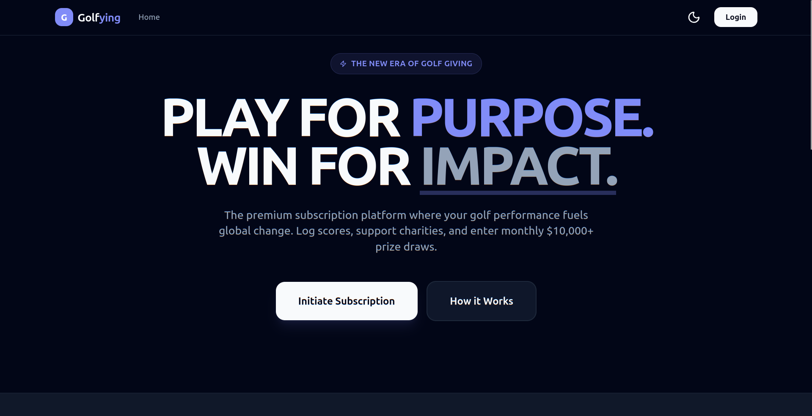

<h1 align="center">
  <a href="https://golfying.com">
    
  </a>
  <br>
  <p>Golfying – Play. Give. Win.</p>
</h1>

<p align="center">
<a href="#"></a>
<a href="#"></a>
<a href="#"></a>
<a href="#"></a>
<!-- <a href="#"></a> -->
<a href="#"></a>
<a href="#"></a>
<a href="#"></a>
<a href="#"></a>
<a href="#"></a>
</p>

<p align="center">
  <a href="#overview">Overview</a> •
  <a href="#features">Features</a> •
  <a href="#technologies-used">Technologies Used</a> •
  <a href="#installation">Installation</a> •
  <a href="#usage">Usage</a> •
  <a href="#screenshots">Screenshots</a> •
  <a href="#contributing">Contributing</a> •
  <a href="#license">License</a> •
  <a href="#contact">Contact</a>
</p>

---

## Overview

Golfying is a modern and high-performance web application designed to transform how golfers track progress, engage with competitions, and support meaningful causes. Players log their latest Stableford scores to enter monthly prize draws, and part of every subscription supports a charity of their choice.

At its core, Golfying blends performance, competition, and social impact into one seamless experience.

---

## Features

### Core System Features
- Track Stableford scores with automatic rotation of the latest 5 entries.
- Monthly prize draws with dynamic scoring logic.
- Multi-tier subscription engine with Stripe.
- Weighted and random draw algorithms for 3, 4, and 5-number matches.
- Secure winners verification workflow (proof upload + admin validation).
- Personal charity selection with contribution tracking.
- Complete dashboard for players and administrators.

### Admin Features
- Manage users, scores, and winners.
- Approve or reject winner proofs.
- Manage charities and featured campaigns.
- Control prize rollovers and monthly pool settings.
- Monitor subscriptions and payouts in real time.

### User Features
- Submit Stableford scores.
- View entry history and winning status.
- Select and update charity preferences.
- Manage subscription plan and billing.
- Upload proof for winning claims.

---

## Technologies Used

### Frontend
- Next.js (App Router)
- TypeScript
- Tailwind CSS
- Framer Motion
- TanStack Query (optional)
- Axios or Fetch for API communication

### Backend
- Next.js API Routes or Node.js + Express
- PostgreSQL (Supabase)
- Stripe (Subscription billing)
- Supabase Storage (winner proof uploads)

### Additional Tools
- Supabase Auth (User authentication)
- Supabase RLS (Security rules)
- Cloudinary or AWS S3 (optional external storage)

---

## Installation

### 1. Clone the Repository

```bash
git clone https://github.com/rajendrapancholi/golfying.git
cd golfying
````

### 2. Install Dependencies

```bash
bun install # I am using bun
# or
npm install
# or
yarn install
```

### 3. Configure Environment Variables

Create a `.env.local` file:

```env
NEXT_PUBLIC_SUPABASE_URL=
NEXT_PUBLIC_SUPABASE_ANON_KEY=

SUPABASE_SERVICE_KEY=
SUPABASE_JWT_SECRET=

STRIPE_SECRET_KEY=
STRIPE_WEBHOOK_SECRET=
STRIPE_PRICE_ID_MONTHLY=
STRIPE_PRICE_ID_YEARLY=
```

### 4. Run the Development Server

```bash
npm run dev
# or
bun dev
```

Visit `http://localhost:3000`.

---

## Usage

### For Players

1. Create an account or log in.
2. Add your latest Stableford scores.
3. Your five latest scores automatically qualify you for the monthly draw.
4. Manage your subscription and charity contributions.
5. Upload proof if you win.

### For Admins

1. Access the admin dashboard.
2. Approve user score proofs.
3. Publish monthly draw results.
4. Manage charity listings and categories.
5. Verify and release payouts.

---

## Screenshots

Add your real screenshots later. Placeholder examples:

### Home Page



### Player Dashboard


### Admin Panel


---

## Contributing

We welcome contributions.

1. Fork the repository.
2. Create a new branch:

```bash
git checkout -b feature-name
```

3. Commit your updates:

```bash
git commit -m "Add feature-name"
```

4. Push the branch:

```bash
git push origin feature-name
```

5. Open a Pull Request.

---

## License

This project is under the MIT License.
See the [LICENSE](LICENSE) file for details.

---

## Contact

* **Project Owner:** Rajendra Pancholi
* **Email:** [rpancholi522@gmail.com](mailto:rpancholi522@gmail.com)
* **GitHub:** [https://github.com/rajendrapancholi](https://github.com/rajendrapancholi)
* **LinkedIn:** [https://www.linkedin.com/in/rajendra-pancholi](https://www.linkedin.com/in/rajendra-pancholi-11a3a5286)

---

